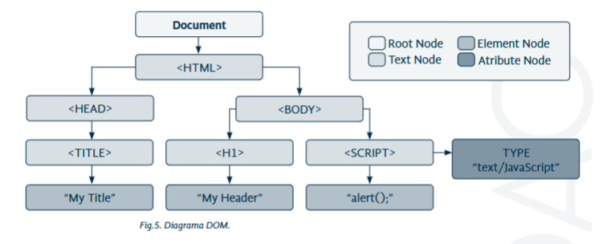

# Tema 4: Lenguajes de Script Cliente y Servidor

---

## 1. Introducción y Contextualización Práctica

En el desarrollo de **páginas web dinámicas** intervienen dos entornos claramente diferenciados:

| Entorno | Lenguaje principal | Ejecución | Finalidad |
|----------|--------------------|------------|------------|
| **Cliente** | JavaScript, jQuery | Navegador | Interactividad, validación, dinamismo |
| **Servidor** | PHP | Servidor web | Procesamiento de datos, conexión con bases de datos |

💡 **Objetivos del tema**:
- Identificar los lenguajes de script de navegador y servidor.  
- Conocer la sintaxis básica de JavaScript y PHP.  
- Elaborar páginas web dinámicas usando ambos entornos.  
- Entender cómo se comunican cliente y servidor.


---

## 2. Sintaxis básica del lenguaje script cliente (JavaScript)

Para incluir código **JavaScript** en un archivo HTML se usa la etiqueta `<script>`.

```html
<script>
  // Código JavaScript aquí
</script>
```

👉 Si no se incluyen las etiquetas `<script>`, el navegador no interpretará el código.

📘 **Ejemplo básico: "Hola Mundo"**

```html
<!DOCTYPE html>
<html>
  <head>
    <title>Mi primer código JavaScript</title>
  </head>
  <body>
    <h1>Mi primer código JavaScript</h1>
    <script>
      document.write("Hola Mundo");
    </script>
  </body>
</html>
```


---

## 3. Elaboración de páginas web con lenguaje script cliente

### 3.1. Sistema DOM

El **DOM (Document Object Model)** representa la estructura de una página web como un árbol de nodos.  
Permite acceder y modificar los elementos HTML desde JavaScript.



Tipos de nodos:
- `Document`
- `Element`
- `Attr`
- `Text`
- `Comment`

---

### 3.2. Consultar o modificar contenido

Funciones útiles del DOM:

| Función | Descripción | Ejemplo |
|----------|--------------|----------|
| `getElementsByTagName()` | Devuelve elementos por etiqueta | `document.getElementsByTagName("p")` |
| `getElementsByName()` | Devuelve elementos por atributo name | `document.getElementsByName("campo")` |
| `getElementById()` | Devuelve un elemento por su id | `document.getElementById("miDiv")` |
| `getElementsByClassName()` | Devuelve elementos por su clase | `document.getElementsByClassName("miClase")` |


📘 **Ejemplo:**

```html
<p id="texto">Texto original</p>

<script>
  var elem = document.getElementById("texto");
  elem.innerHTML = "Texto modificado con JavaScript";
</script>
```

### 3.3. Crear nuevos nodos

También podemos crear nuevos elementos desde JavaScript:

| Función | Descripción |
|----------|--------------|
| `document.createElement("etiqueta")` | Crea un nuevo elemento HTML |
| `document.createTextNode("texto")` | Crea un nodo de texto |
| `element.appendChild(nuevoElemento)` | Inserta un elemento hijo dentro de otro |

📘 **Ejemplo:**

```html
<div id="contenedor"></div>

<script>
    var nuevo = document.createElement("p");
    var texto = document.createTextNode("Este párrafo fue creado dinámicamente.");
    var caja = document.getElementById("contenedor");
    nuevo.appendChild(texto);
    caja.appendChild(nuevo);
</script>
```


📺 [Vídeo 1: Herramienta de virtualización Hyper-V](https://vimeo.com/976314524/9cb1532c7d)  

---

### 3.4. jQuery

**jQuery** simplifica el trabajo con el DOM y los eventos.

```javascript
$(document).ready(function(){
  $("#boton").click(function(){
    alert("Has pulsado el botón");
  });
});
```

💡 Selección de elementos:

| Tipo de selección | Ejemplo |
|--------------------|----------|
| Por id | `$("#id")` |
| Por etiqueta | `$("p")` |
| Por clase | `$(".clase")` |
| Por atributo | `$("a[rel]")` |


---

## 4. 🧩 Caso Práctico 1: “Primera prueba con JavaScript”

**Planteamiento:**  
Crear una página que muestre un mensaje de saludo al pulsar un botón.

📘 **Código completo:**

```html
<!DOCTYPE html>
<html lang="es">
  <head>
    <meta charset="UTF-8">
    <script>
      function pulsar() {
        alert("Hola, bienvenido a una página habladora.");
      }
    </script>
  </head>
  <body>
    <form>
      <input type="button" value="Púlsame" onClick="pulsar()">
    </form>
  </body>
</html>
```

📺 [Vídeo 1: Simulador lenguaje script cliente. Primeros pasos](https://bit.ly/3J5AeEd)  

---

## 5. Sintaxis básica del lenguaje script servidor (PHP)

El código **PHP** se ejecuta en el **servidor**, y el resultado (HTML o JS) se envía al navegador.

### 5.1. Formas de incluir PHP

1️⃣ **Archivo externo PHP:**
```php
<?php include("menu.php"); ?>
```

2️⃣ **Código embebido en HTML:**
```html
<html>
  <body>
    <?php
      echo "Hola Mundo!!!";
    ?>
  </body>
</html>
```


---

### 5.2. Definición de Variables

```php
<?php
$var = "Hola";
$_var = "Hola2";
?>
```

💡 Reglas:
- Deben empezar con `$`.
- Son **case-sensitive** (`$Var` ≠ `$var`).
- No pueden empezar por número.

---

### 5.3. Funciones en PHP

```php
<?php
function saludar($nombre) {
  echo "Hola $nombre";
}

$nombre = "Pepe";
saludar($nombre);
?>
```

📘 **Función con retorno:**

```php
function suma($a, $b) {
  return $a + $b;
}

echo suma(5, 3); // 8
```

📘 **Función con varios parámetros:**

```php
<?php
function saludar($nombre, $apellido) {
  echo "Hola $nombre $apellido<br>";
}

$nombre = "Pepe";
$apellido = "García";

saludar($nombre, $apellido);   // Hola Pepe García
saludar($apellido, $nombre);   // Hola García Pepe
?>
```

---

## 6. 🧩 Caso Práctico 2: “Primer programa en PHP”

**Planteamiento:**  
Crear una aplicación PHP que compare dos números y muestre el mayor.

📘 **HTML principal (`programa.html`):**

```html
<html>
  <body>
    <form action="comparador.php" method="GET">
      Primer valor: <input type="text" name="valor1"><br>
      Segundo valor: <input type="text" name="valor2"><br>
      <input type="submit" value="Comparar">
    </form>
  </body>
</html>
```

📘 **Archivo PHP (`comparador.php`):**

```php
<html>
  <body>
    <p>
      <?php 
      $n1 = intval($_GET['valor1']);
      $n2 = intval($_GET['valor2']);

      if ($n1 > $n2) {
          echo "El número mayor es ($n1)";
      } else {
          echo "El número mayor es ($n2)";
      }
      ?>
    </p>
  </body>
</html>
```


---

## 7. Relaciones entre Páginas Web y Bases de Datos

Las páginas web dinámicas pueden **mostrar información almacenada** en bases de datos.  
PHP facilita la conexión con bases de datos como **MySQL** o **MariaDB**.

📘 **Ejemplo actualizado con `mysqli`:**

```php
<?php
$link = mysqli_connect("localhost", "usuario", "password", "base_datos");

if (!$link) {
  die("Error de conexión: " . mysqli_connect_error());
}

$result = mysqli_query($link, "SELECT nombre, apellidos FROM clientes");

while ($row = mysqli_fetch_assoc($result)) {
  echo $row['nombre'] . " " . $row['apellidos'] . "<br>";
}

mysqli_free_result($result);
mysqli_close($link);
?>
```


---

## 8. Resumen del Tema

- **JavaScript** actúa en el **cliente** (navegador).  
- **PHP** actúa en el **servidor** (procesa y devuelve HTML).  
- Ambos lenguajes pueden combinarse para crear **sitios web dinámicos**.  
- **jQuery** simplifica el acceso al DOM y la gestión de eventos.  
- PHP permite **definir funciones**, **pasar parámetros**, y **conectarse a bases de datos**.

📊 **Esquema resumen:**


---

## 9. Bibliografía y Recursos

- [W3Schools – JavaScript Reference](https://www.w3schools.com/js/)
- [MDN Web Docs – DOM](https://developer.mozilla.org/es/docs/Web/API/Document_Object_Model)
- [jQuery Learning Center](https://learn.jquery.com/)
- [PHP Manual Oficial](https://www.php.net/manual/es/)
- [MDN – Programación lado servidor](https://developer.mozilla.org/es/docs/Learn/Server-side)
